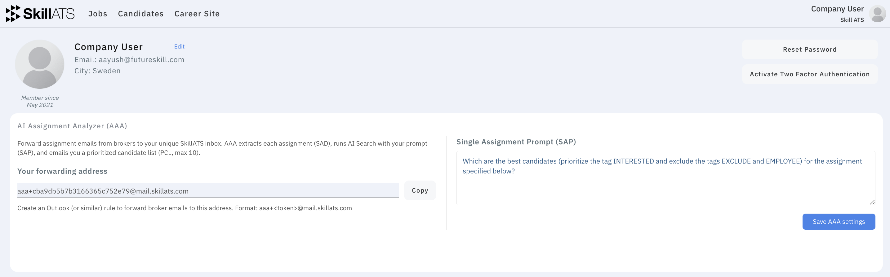

# What is AAA?

**AI Assignment Analyzer (AAA)** turns broker assignment emails into a shortlist of matching candidates from your SkillATS talent pool.

## In plain language

1. You get a personal SkillATS forwarding address.
2. You (or an email rule) forward assignment emails there.
3. SkillATS reads each assignment, searches your candidates using a prompt you write once, and emails you a ranked shortlist (up to 10 people).
4. Open the email link to continue in **AI Candidate Search** with that shortlist ready.

## Words you’ll see

| Term                  | Meaning                                                                       |
| --------------------- | ----------------------------------------------------------------------------- |
| **AAA**               | The whole feature: email → shortlist                                          |
| **Your prompt (SAP)** | Instructions you write once (“prefer X, need Y…”) applied to every assignment |
| **Assignment**        | One role/requirement extracted from an email                                  |
| **Shortlist**         | Up to 10 matching candidates emailed to you                                   |

You don’t need to memorise the acronyms — they’re only labels on your profile screen.

## When to use AAA

| Situation                                            | Use                                                         |
| ---------------------------------------------------- | ----------------------------------------------------------- |
| One-off question in the app                          | [AI Candidate Search](../candidates/AI_candidate_search.md) |
| Regular broker emails you want handled automatically | **AAA**                                                     |

Next: [Set up AAA](Setup.md).
