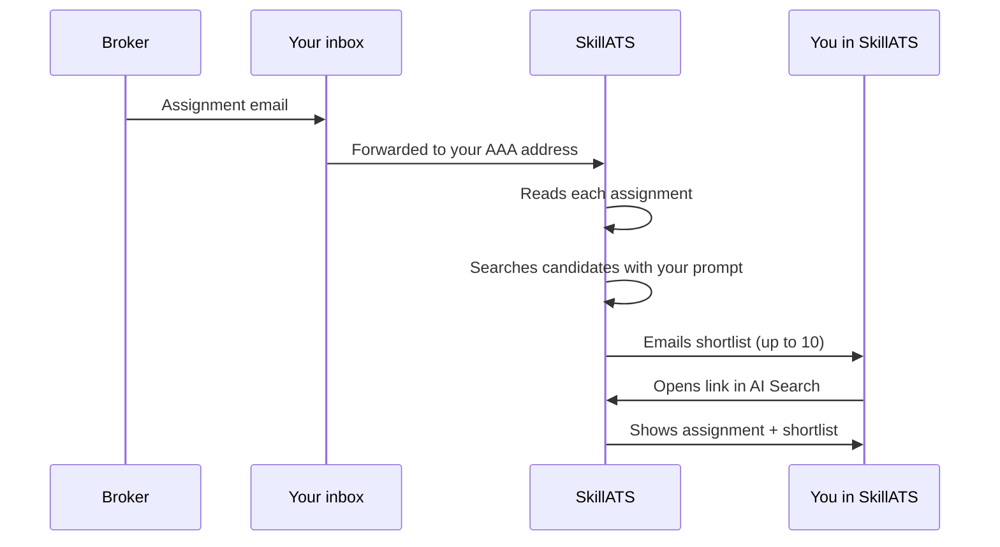
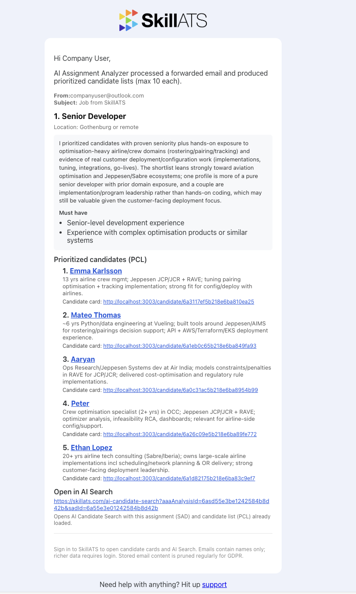
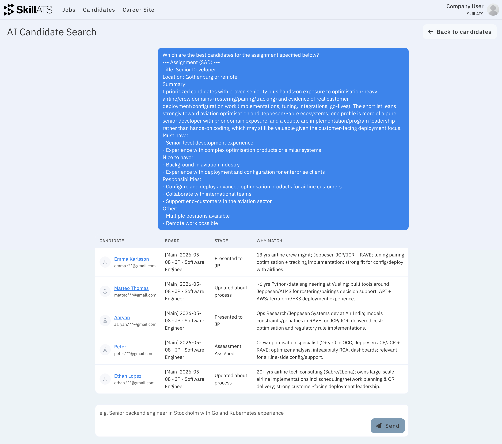

# How AAA works day to day

## The flow

1. A broker sends an assignment email.
2. Your rule forwards it to SkillATS.
3. SkillATS extracts each assignment from the message.
4. It searches your candidates using the prompt you saved.
5. You get an email with a shortlist (up to 10 people).
6. Open the link to review and continue in AI Candidate Search.

From there, open candidates, compare them, and move good matches onto the right job board.

## Privacy

Candidate data still follows your company’s retention and privacy rules. See [Privacy and GDPR](../settings/GDPR_and_privacy.md).
