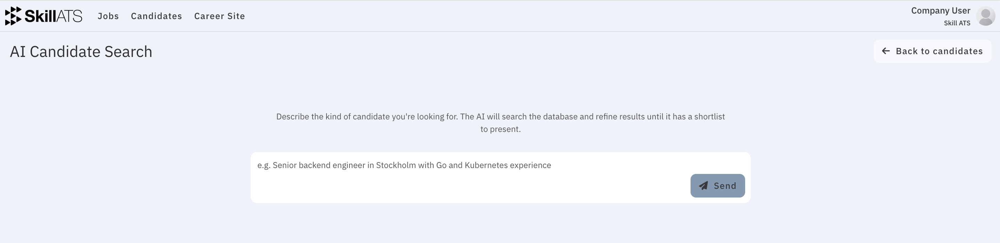
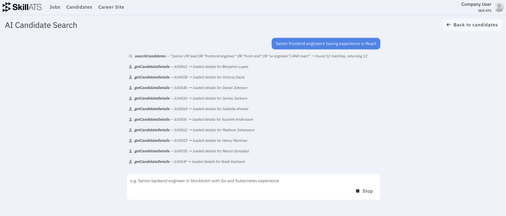
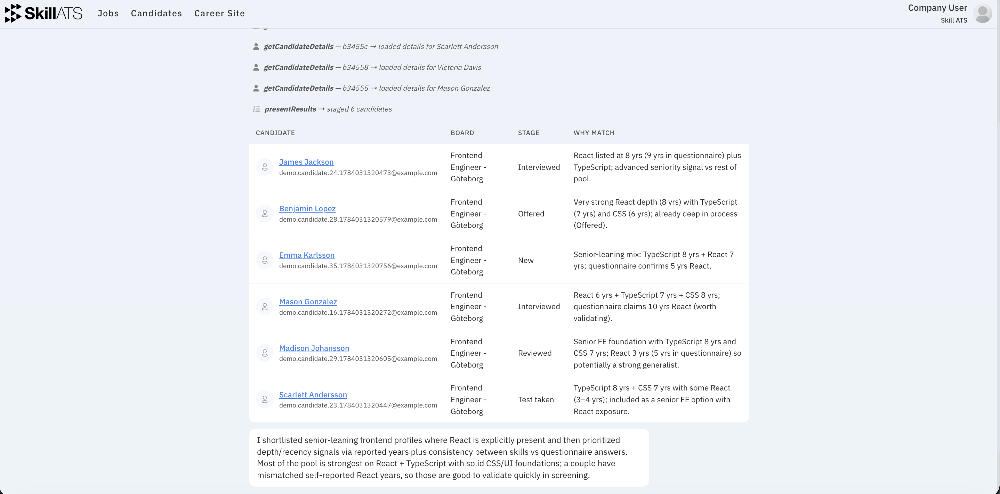

# AI Candidate Search

AI Candidate Search helps you find people already in SkillATS by describing who you need in plain language — instead of building complex filters yourself.

## How to open it

1. Go to **Candidates**.
2. Click **AI Search**.

You can also arrive here from an AAA result email when a shortlist is ready.

## How to use it

1. Type what you’re looking for in the chat box.
2. Send your message and wait while SkillATS searches.
3. Review the shortlist in the results table.
4. Open any candidate to see more detail.

### Example prompts

- “Senior React developers who completed tests in the last six months”
- “Candidates in Stockholm with strong questionnaire ratings”
- “People who would fit this assignment: …”

## Tips

- Be specific about skills, location, seniority, and how recent activity or ratings matter.
- Open a few people from the shortlist before deciding — treat AI Search as a starting point.
- For recurring broker emails, set up [AAA](../aaa/AAA_overview.md) so shortlists arrive in your inbox automatically.
