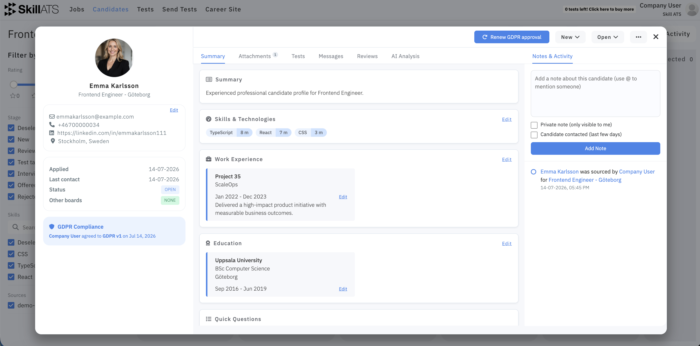
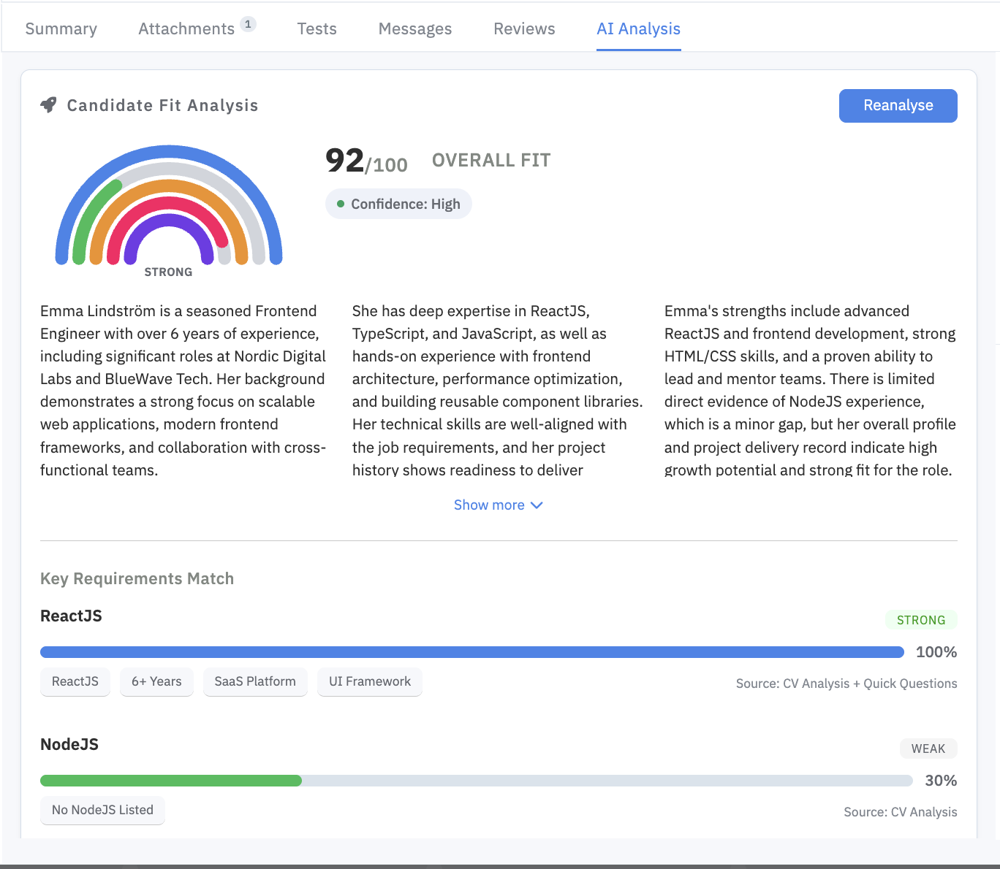
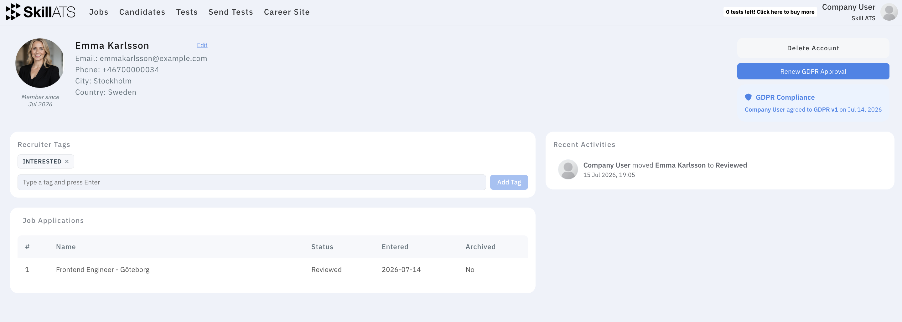

# Candidate details

Click a candidate from the list, board, or AI Search results to open their record.

## What’s on a candidate record

Depending on your setup, you may see:

- Contact and personal details
- Applications and which jobs they’re in
- Tests and ratings
- Tags and notes
- Activity history
- Privacy options (renew consent or request deletion where available)

## Profiles

You can also open a fuller **profile** for a candidate (tags, applications, activity). Your own recruiter profile is where you manage account details and [AAA](../aaa/AAA_overview.md).

