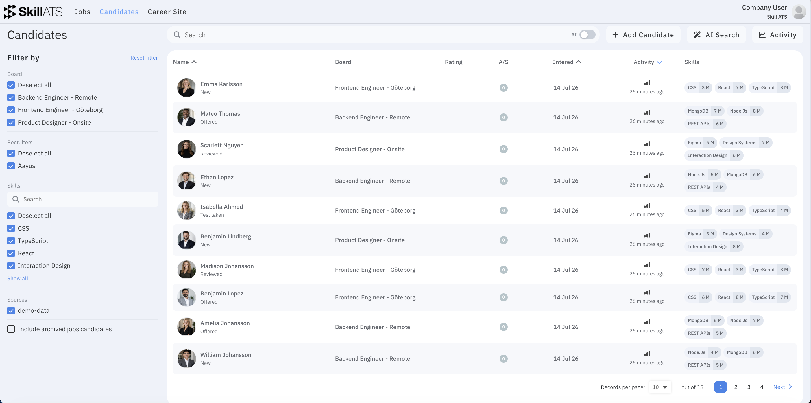

# Your candidates

Open **Candidates** in the top menu to see everyone in your company talent pool — across jobs and stages.

## What you can do

- Search and filter the list
- Add a new candidate
- Open someone to see their full record
- Start **AI Search** when you want SkillATS to find matching people for you

## Add a candidate

Click **Add Candidate** to open the **Add new candidate** wizard. It has a step bar on the side, and each step ends with **Save and Continue** (the last step reads **Submit**). You can click a completed step in the side bar to go back.

You can also start this from a board (**Add Candidate**, or a stage menu → **Candidate**), which pre-selects the board and stage for you.

### Step 1 — Upload CV

Drag and drop a CV, or click the drop area to browse.

- Supported formats: **PDF, DOCX** — maximum size **5 MB**
- Added files are listed so you can **Remove** any before continuing
- When you continue, SkillATS reads the CV and tries to **auto-fill** the next steps (name, email, phone, location, projects, education). A short “fetching data” message appears while it works.

This step is optional — you can continue without a file and type everything yourself.

### Step 2 — Personal details

Fill in the basic details. Anything read from the CV is pre-filled here so you only correct what’s needed.

| Field | Notes |
|-------|-------|
| **Board and Stage** | Required. Choose which board and which stage to add the person to. If you started from a board, this is already set. |
| **Name** | Required. |
| **Email** | Optional here (validated if entered). |
| **Phone** | Optional. |
| **LinkedIn** | Optional. |
| **Country and City** | Optional. |

If something required is missing, SkillATS highlights the field and shows a short message (for example “Name is required”).

### Step 3 — Quick questions (only sometimes)

This step appears **only if the chosen board or job has quick questions** set up. Answer the short questions (text, dropdown, choices, or sliders). Questions marked with `*` are required, and the answers contribute to the candidate’s questionnaire rating.

If the board has no quick questions, this step is skipped and you go straight to Other info.

### Step 4 — Other info

Add anything extra. All fields here are optional.

- **Cover letter** — upload a PDF/DOCX (drag-and-drop, max 5 MB)
- **Personal letter** — free text about the candidate
- **Upload image** — a profile photo (PNG/JPG, max 5 MB); you can crop it after selecting
- **Company and Projects** — add roles with company and dates; use **+Add job** for more, **Remove** to delete
- **Education** — add degrees, school, city, and dates; use **+Add education** for more

### Finish

Click **Submit** on the last step. SkillATS creates the candidate, shows a **Candidate added successfully** confirmation, and opens their record. If something goes wrong, the wizard stays open so you can fix the details and try again.

## Privacy

When someone’s data is due for deletion under your retention rules, they appear on a separate list linked from Settings. See [Privacy and GDPR](../settings/GDPR_and_privacy.md).
