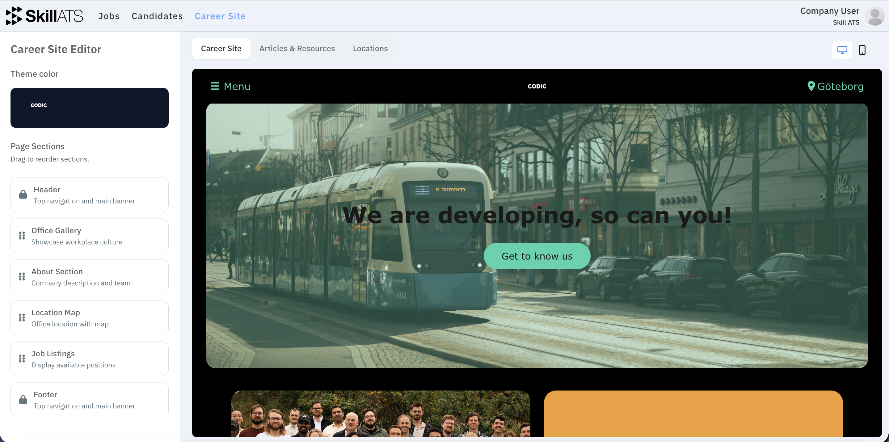

# Build your career site

Open **Career Site** in the top menu. This is where you design the public pages applicants see — your company homepage, jobs, articles, and locations.

## What you can set up

- Homepage sections and layout
- Colors and branding
- How jobs are listed
- Location pages
- Articles and other content
- A preview before you publish

Use **Preview** to see the site as candidates will see it, then publish when you’re happy.

## After publishing

Applicants use your [public career site](Public_career_site.md) to browse jobs and apply. New applications show up on the matching [hiring board](../jobs/Candidates_board.md).
