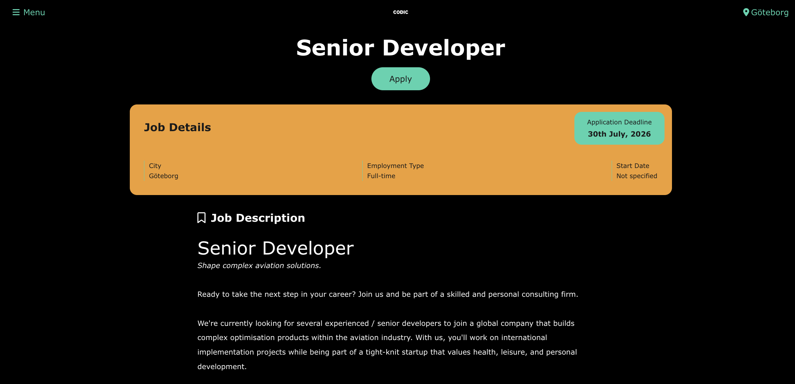
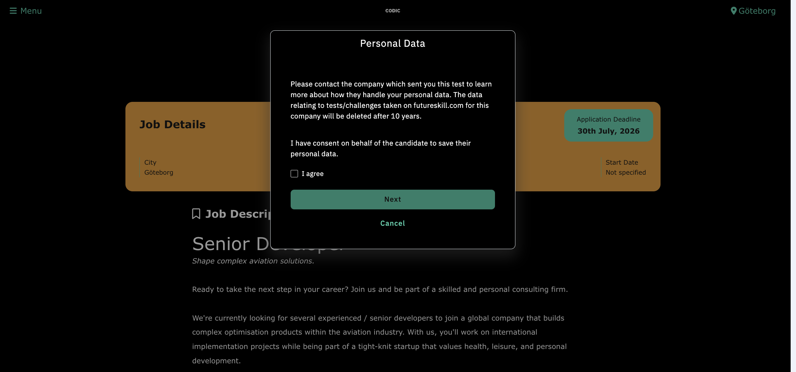
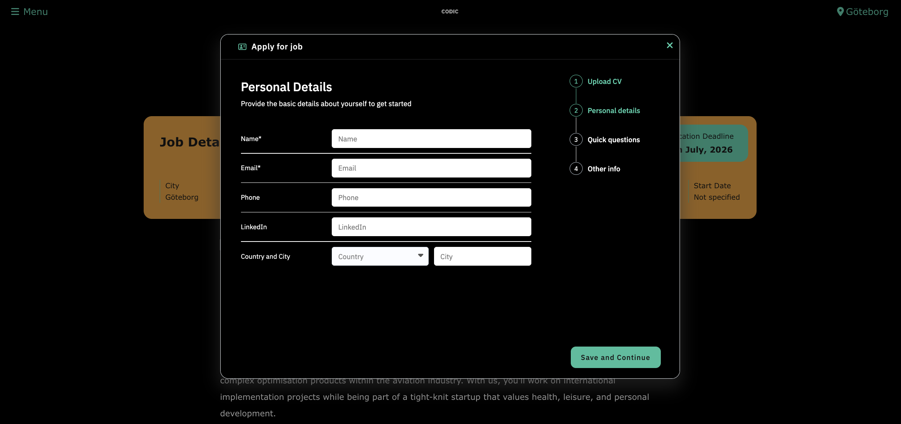

# What candidates see

Your public career site is the face of hiring for your company. Candidates can browse jobs, read articles, and apply — often with a note that the site is powered by Skill ATS.

## Typical pages

- **Home** — your career landing page
- **Jobs** — list of open roles
- **Job detail** — description and apply form
- **Articles** — company stories or tips
- **Locations** — pages per office or region

## How applying works

1. The candidate opens a job.
2. They fill in the application (including privacy/consent where required).
3. The application appears in SkillATS on that job’s board for your team.

!!! tip
Edit the look and content anytime from **Career Site** in SkillATS — see [Build your career site](Career_editor.md).
