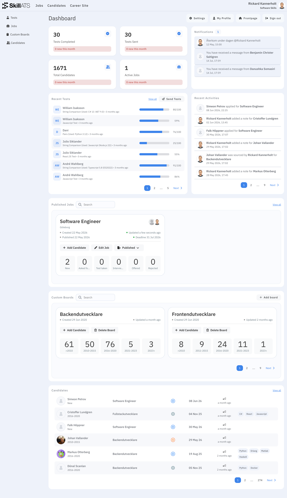

# Your dashboard

Your dashboard is the home screen after you log in. It gives a quick view of hiring activity and shortcuts into the rest of SkillATS.

## What you’ll see

Depending on your company, the dashboard may show:

- Recent or active **jobs**
- Recent **candidates** and hiring activity
- Custom **boards** for your pipelines
- Notifications or activity updates
- Links to **Settings**, **Profile**, and your **career site**

## Quick actions

| I want to…             | Do this                              |
| ---------------------- | ------------------------------------ |
| Work with jobs         | Open **Jobs** in the top menu        |
| Browse candidates      | Open **Candidates** in the top menu  |
| Edit company setup     | Open **Settings**                    |
| Edit my details or AAA | Open **Profile**                     |
| Change the career site | Open **Career Site** in the top menu |
| Create a custom board | In **Custom Boards**, click **Add board** |

Custom boards are pipelines **without** a job — useful for projects or talent pools. See [Custom boards](../jobs/Custom_boards.md). Job pipelines are covered under [The hiring board](../jobs/Candidates_board.md).

!!! tip
Click the SkillATS logo anytime to return to the dashboard.
