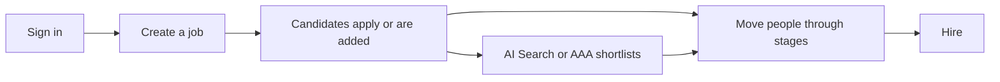
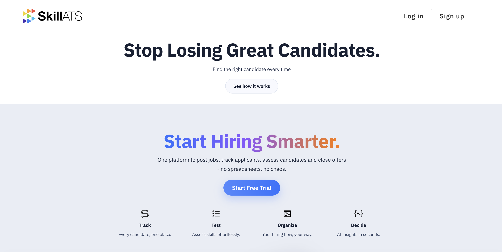

# Getting started

SkillATS helps recruiting teams hire from one place: jobs, pipelines, assessments, AI-assisted search, a public career site, and optional automation for broker assignment emails.

## Who this help is for

- Recruiters and hiring managers
- Admins who set up stages, team members, and integrations
- Anyone publishing a career site for applicants

## How hiring usually flows

1. Sign up or log in.
2. Create a job and open its pipeline (board).
3. Candidates apply via your career site, or you add them yourself.
4. Move people through stages, run tests, and make decisions.
5. Use **AI Candidate Search** or **AAA** when you need a shortlist faster.

## Suggested reading order

1. [Sign up and log in](Signup_and_login.md)
2. [Your dashboard](Dashboard.md)
3. [Manage jobs](../jobs/Manage_jobs.md) and [the pipeline board](../jobs/Candidates_board.md)
4. [Candidates](../candidates/Candidates_list.md) and [AI Candidate Search](../candidates/AI_candidate_search.md)
5. [AAA](../aaa/AAA_overview.md) if you receive broker assignment emails
6. [Career site](../career/Career_editor.md)
7. [Company settings](../settings/Company_settings.md)

