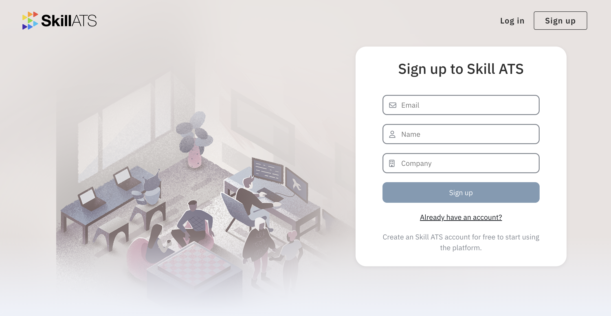
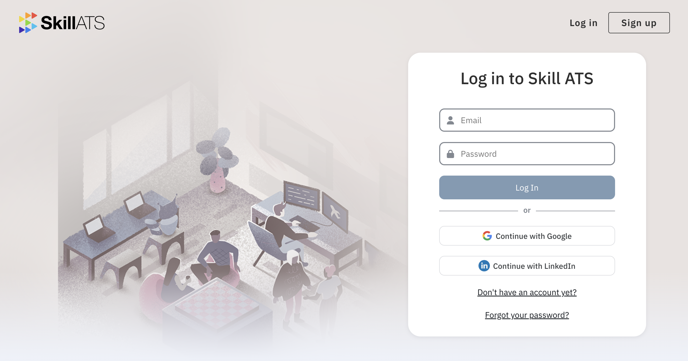

# Sign up and log in

## Create an account

1. Go to [skillats.com](https://skillats.com) and open **Sign up**.
2. Enter your details and create your company account.
3. Confirm any email step if asked, then sign in.

## Log in

1. Open **Log in**.
2. Enter your email and password.
3. You’ll land on your **dashboard**.

## Forgot your password?

1. On the login page, choose the option to reset your password.
2. Check your email for the reset link.
3. Set a new password and sign in again.

!!! tip
If you don’t see the email, check spam and confirm you used the same address as your SkillATS account.
