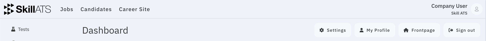

# Welcome to SkillATS

SkillATS is your hiring workspace. Create jobs, manage candidates through each stage, search your talent pool with AI, publish a company career site, and optionally turn broker assignment emails into shortlists with AAA.

Open the product at [skillats.com](https://skillats.com).

## What you can do here

| Goal | Start with |
|------|------------|
| Create an account and sign in | [Sign up and log in](getting_started/Signup_and_login.md) |
| See an overview of hiring | [Your dashboard](getting_started/Dashboard.md) |
| Post and manage jobs | [Jobs](jobs/Manage_jobs.md) |
| Work with people in your pipeline | [Candidates](candidates/Candidates_list.md) |
| Ask AI to find matching people | [AI Candidate Search](candidates/AI_candidate_search.md) |
| Forward broker emails for shortlists | [AI Assignment Analyzer (AAA)](aaa/AAA_overview.md) |
| Build your public career pages | [Career site](career/Career_editor.md) |
| Configure your company | [Settings](settings/Company_settings.md) |

## Menus you’ll use most

After you sign in, the top of the app shows:

- **Jobs** — all your openings
- **Candidates** — everyone in your talent pool
- **Career Site** — build what applicants see

Click the SkillATS logo to return to your **dashboard**. Open **Settings** and **Profile** from the dashboard or your account menu.

## New to SkillATS?

Start here: [Getting started](getting_started/Overview.md).
