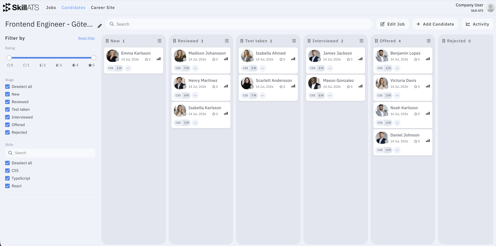

# The hiring board

Each job has a **board** (pipeline) — columns for your hiring stages. You move candidates between columns as they progress from application to hire or reject.

Open a board from **Jobs**, or from a job’s board link on the dashboard.

You can also create **custom boards** that are not linked to a job. They use the same layout, but job-linked stage actions (automatic tests and rejection email) do not apply. See [Custom boards](Custom_boards.md).

## What you can do on the board

| Action | How |
|--------|-----|
| Move a candidate | Drag their card to another stage |
| Open a candidate | Click the card (Cmd/Ctrl+click opens in a new tab) |
| Add a candidate | Use **Add Candidate**, or the stage menu → **Candidate** |
| Search | Use the search bar (name, email, and related text) |
| Filter | Filter by rating, stage, skills, and sources — then **Reset filter** when done |
| Edit the job | On job boards, use **Edit Job** |
| See activity | Open the **Activity** side panel |
| Rename the board | Click the edit icon next to the board name |

### On each stage column

- See how many candidates are in that stage
- Rename the stage by clicking its name
- Drag columns sideways to reorder stages (clear stage filters first if reordering is disabled)
- Open the stage menu (hamburger) to:
  - **Candidate** — add someone into this stage
  - **Send tests automatically** — special action (see below)
  - **Stage** — insert a new stage after this one
  - **Remove** — delete the stage (candidates move to the first stage)

## How stages work

Stages are the **named columns** on your board (for example New, Interviewed, Assessment Assigned, Test Taken, Offered, Rejected).

### Company default stages

In **Settings → Recruitment stages**, you set the default stage names for new boards. Those names are copied when a new job board is created. You can still rename, add, reorder, or remove stages on each board afterwards.

See [Company settings](../settings/Company_settings.md).

### Typical flow

1. A candidate applies on your [career site](../career/Public_career_site.md), or you add them manually.
2. They land in an early stage (often the first column).
3. You drag them through stages as they interview, take tests, and progress.
4. You finish by rejecting them or marking them hired on the [candidate page](../candidates/Candidate_record.md).

## Special stage: Send tests automatically (assignment / assessment)

Some stages are used when you **assign assessments** — for example a stage named **Assessment Assigned** or **Assignment Assigned**.

On a job board that has tests configured, open the stage menu and tick **Send tests automatically**.

What that means:

- Only **one** stage on the board can have this on at a time.
- A tooltip on that stage explains: tests are sent automatically when a candidate is moved there.
- When you **drag** a candidate into that stage, SkillATS asks: **Send tests to [name]?**  
  Confirm to email them the job’s tests; cancel to leave them in the stage without sending.
- Adding a candidate **directly into** that stage can also trigger automatic test sending.

!!! tip
    Use this stage when “moved here” should mean “assessment has been assigned.” Name it something clear for your team (for example **Assessment Assigned**), then turn on **Send tests automatically**.

!!! note
    This only works on **job boards** with tests set up. On [custom boards](Custom_boards.md) (no job), **Send tests automatically** is not available.

## Special stage: Reject

Reject behaviour is tied to the stage **name**.

If a stage is named **Rejected** or **Reject**:

1. Drag a candidate into that column.
2. SkillATS asks: **You are rejecting [name]?** and whether to send an **automatic rejection email**.
3. Confirm to send the email (using your job’s rejection template), or skip the email and still leave them in the reject stage.

On the board card you may see:

- **Decline** — rejected, rejection email not sent yet
- **Rejection Email** — automatic rejection email already sent

You can also reject from the candidate page status dropdown (**Rejected**), which can move them into a Reject/Rejected stage and offer the same email prompt.

!!! note
    For reject behaviour to work, keep a stage named **Rejected** or **Reject**. Renaming it to something else turns off this automatic prompt. Automatic rejection email also needs a **job board** — it does not work the same way on [custom boards](Custom_boards.md).

## Hired vs stages

**Hired** is a **status** on the candidate (Open / Hired / Rejected), not a special stage action.

- Mark someone hired from the [candidate page](../candidates/Candidate_record.md) status dropdown.
- Hired candidates show a **Hired** tag on their board card.
- You can still keep a stage named Offered, Hired, or similar for your pipeline — that is separate from the Hired status.

## Tips

- Clear **stage filters** before reordering columns if the board won’t let you drag stages.
- Configure default stage names once under **Settings**, then fine-tune each job board as needed.
- Open the candidate card for notes, reminders, AI analysis, tests, and more — see [Candidate details](../candidates/Candidate_record.md).
