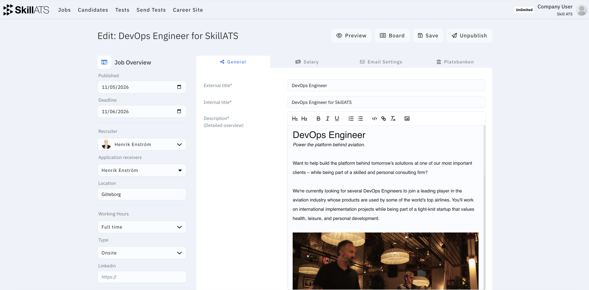
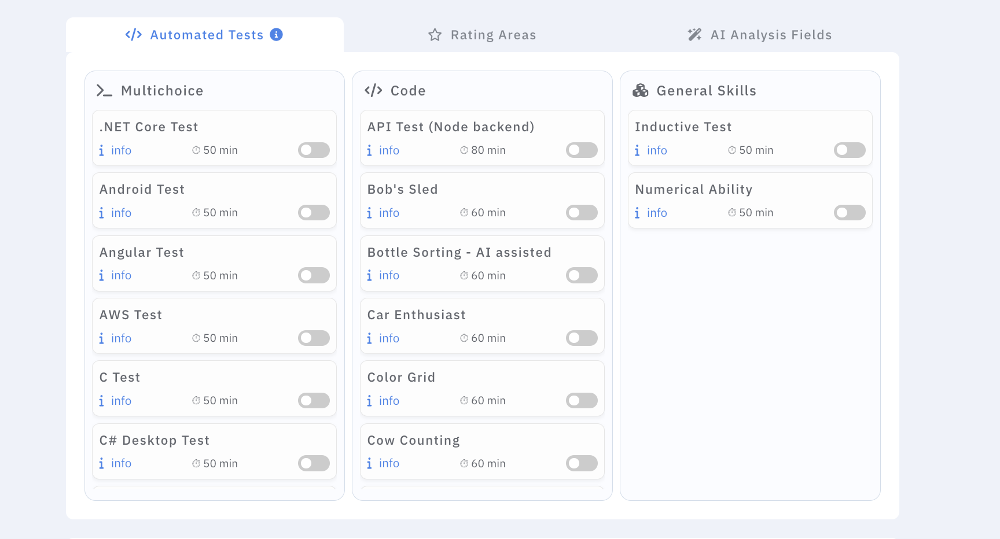
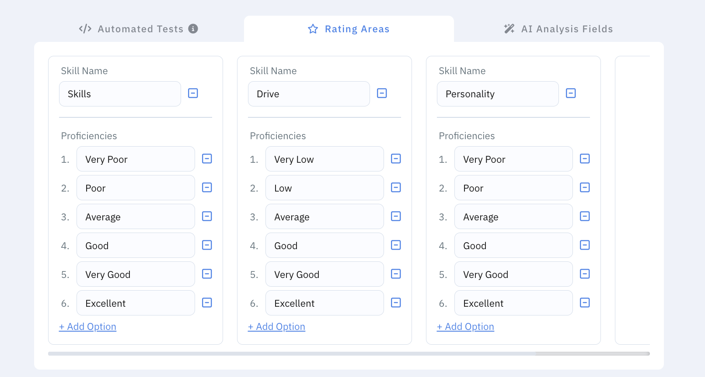
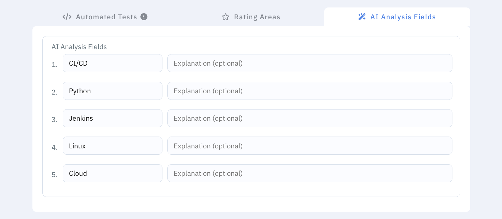
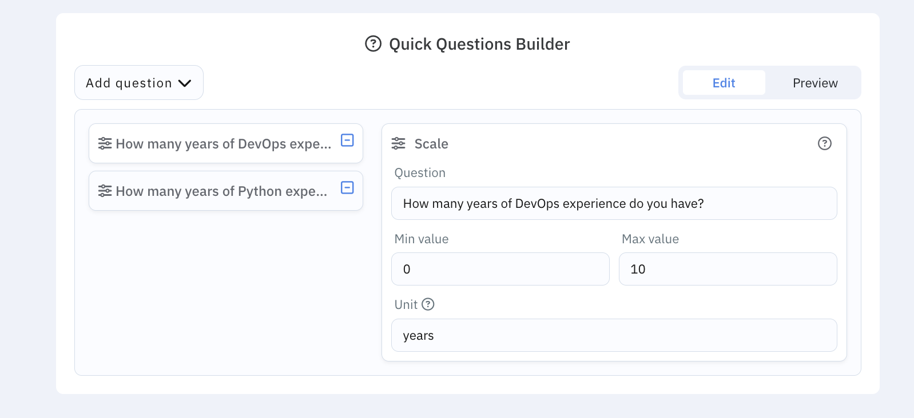

# Create and edit jobs

From **Jobs**, choose to create a new job or open an existing one to edit.

## What to fill in

A job typically includes:

- **Basics** — title, description, location, department
- **Email** — how communications are handled for this role
- **Tests** — assessments candidates should take
- **Ratings** — how you score applicants for this role
- **AI-related fields** — when your company uses AI-assisted analysis
- **Posting options** — for example publishing to Platsbanken if that integration is enabled

Save when you’re done. The job appears in your jobs list, and you can open its pipeline board to manage applicants.

## After you save

- Applicants who apply on your career site can land on this job’s board.
- You can keep editing the job as the role evolves.
- Team members with access will see the same job in **Jobs**.
