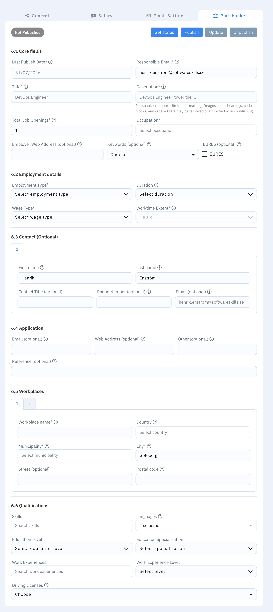

# Create and edit jobs

From **Jobs**, choose to create a new job or open an existing one to edit.

## What to fill in

A job is divided into the following sections.

### Job overview

- **Published** — the date from which the job should be available.
- **Deadline** — the last date for applications. This is also used as the last publication date when publishing to Platsbanken.
- **Recruiter** — the team member responsible for the job.
- **Application receivers** — team members who should receive application notifications. These people can also be used as contact persons in the Platsbanken ad.
- **Location** — the main city or location for the role.
- **Working hours** — whether the position is full-time or part-time.
- **Type** — whether the work is onsite, hybrid, or remote.
- **LinkedIn** — an optional link related to the role or its LinkedIn posting.
- **English and Swedish** — the required proficiency level for each language.
- **Display company name on Ads** — controls whether the company name is visible in the published job ad.
- **Display test result to candidate** — allows candidates to see their assessment results.
- **Logo** — the image displayed with the job.

### General

- **External title** — the public-facing job title shown to candidates. This field is required.
- **Internal title** — the title your team sees inside SkillATS. It can be different from the public title and is required.
- **Description** — the full job advertisement, including responsibilities, requirements, benefits, and application information. This field is required.
- **Short description** — a concise summary used where the full description would be too long.
- **Skills (Required Competencies)** — searchable competency labels for the role. Type a skill and press **Enter** to add it.

### Salary

- **Show salary** — enables salary information in the job.
- **From and To** — the minimum and maximum salary. Both values must be whole, non-negative numbers, and **To** cannot be lower than **From**.
- **Currency** — SEK, USD, GBP, or EUR.
- **Period** — whether the amount is daily, weekly, monthly, or yearly.

### Email settings

Email settings are available after the job has first been created.

- **Candidate Applied** — the email sent when a candidate applies.
- **Candidate Rejected** — the email sent when a candidate is rejected.

All four subject/template fields are required. Use **Save Template** to save email changes independently of the main job form.

### Automated tests

Select the assessments that belong to the job. Tests are grouped by type, such as multichoice, general skills, and coding.

- Use the switch on a test card to enable or disable it.
- Click **info** to review what the test contains.
- Click the duration to change the allowed completion time; the minimum is one minute.
- Where supported, choose which programming or spoken languages candidates may use.

Enabled tests are sent automatically when a candidate is moved to the **Assessment Assigned** stage.

### Rating areas

Rating areas define the criteria recruiters use when evaluating applicants.

- **Skill name** — the criterion being assessed, such as Communication, Java, or Leadership.
- **Proficiencies** — the available rating labels, for example Very Low, Average, Good, and Excellent.
- Use **Add Option** to add another proficiency level.
- Use **Add Skill** to create another rating area.

Skill names and proficiency labels cannot be empty.

### AI Analysis Fields

Configure up to five role-specific points that AI-assisted candidate analysis should consider.

- **Field name** — the criterion to analyze, such as Cloud architecture or Stakeholder management.
- **Explanation** — optional guidance describing what evidence the AI should look for and how the criterion should be interpreted.

Use specific criteria and explanations. For example, `Kubernetes experience` with `Look for production operation, troubleshooting, and cluster design—not only course attendance` gives the analysis clearer guidance.

### Quick Questions

Quick Questions collect role-specific information from candidates as part of the application.

Available question types are:

- **Scale** — a simple numeric scale.
- **Advanced Scale** — a configurable range with scoring and optional tagging.
- **Short text answer** — a one-line response.
- **Long text answer** — a longer written response.
- **Single choice** — the candidate selects one option.
- **Multiple choice** — the candidate can select several options.
- **Select from list** — the candidate chooses one option from a dropdown.

Enter a clear question title, add options where required, and choose whether the question is mandatory. Use **Preview** to check the candidate experience before saving. Empty question titles or choice labels prevent the job from being saved.

### Platsbanken

This section appears only when the Platsbanken integration is enabled. Save the job before publishing it to Platsbanken.

- **Core fields** — responsible email, number of openings, occupation, employer website, keywords, and EURES options. Title, description, and last publication date are taken from the main job fields.
- **Employment details** — employment type, duration, wage type, and worktime extent.
- **Contacts** — optional contact people based on the selected application receivers.
- **Application** — how candidates should apply: email, web address, or another method. At least one method is required.
- **Workplaces** — workplace name and address details. Up to three workplaces can be stored, although Platsbanken currently displays only the first.
- **Qualifications** — skills, languages, education, work experience, and driving licences using Platsbanken taxonomy values.

Use **Publish**, **Update**, and **Unpublish** to manage the external ad. Unsaved changes must be saved before publishing or updating.

Save when you’re done. The job appears in your jobs list, and you can open its pipeline board to manage applicants.

## After you save

- Applicants who apply on your career site can land on this job’s board.
- You can keep editing the job as the role evolves.
- Team members with access will see the same job in **Jobs**.

