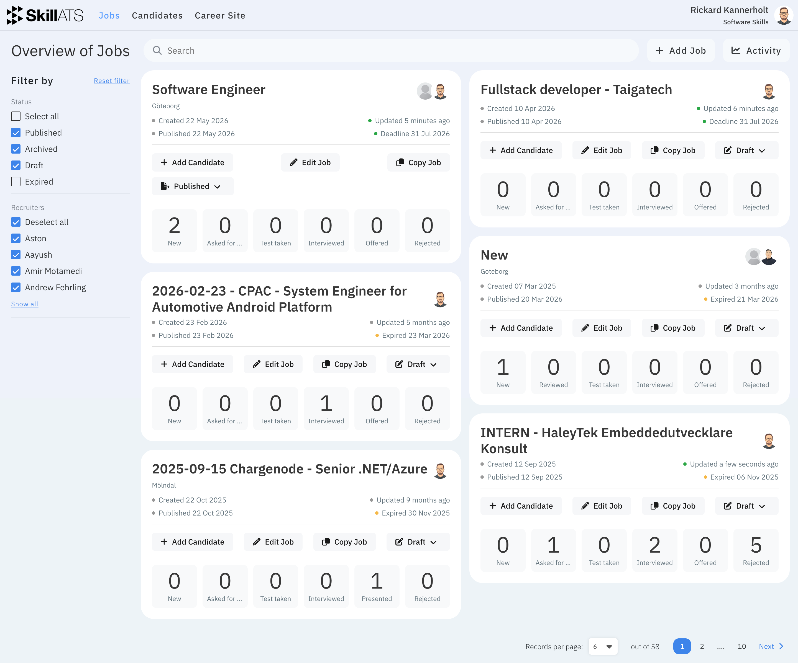

# Manage jobs

Open **Jobs** in the top menu to see all openings for your company. From here you can search, filter, create new jobs, and open each job’s hiring pipeline.

## What you can do

- Find a job with search and filters
- Open a job to edit it
- Open the **board** (pipeline) for that job
- Create a new job

## Next steps

- [Create or edit a job](Create_and_edit_jobs.md)
- [Move candidates on the board](Candidates_board.md)
