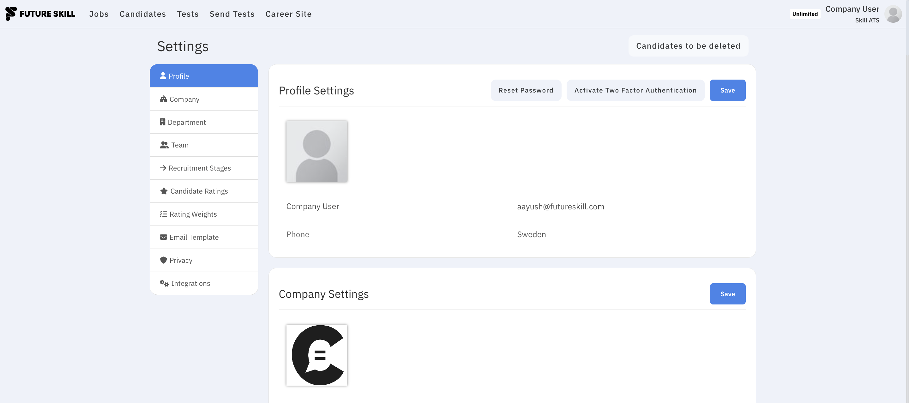
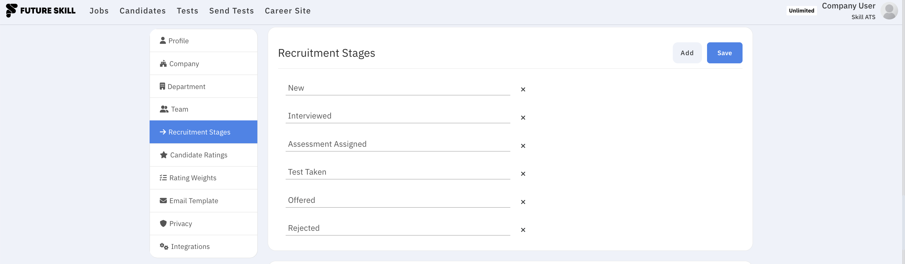

# Company settings

Open **Settings** from the dashboard or account menu to configure how SkillATS works for your company.

## Common settings

| Section                | What it’s for                                             |
| ---------------------- | --------------------------------------------------------- |
| **Company**            | Company name and details                                  |
| **Departments**        | How you organise teams or units                           |
| **Team**               | Invite colleagues and manage access                       |
| **Email templates**    | Standard messages you send to candidates                  |
| **Privacy**            | Retention and deletion-related options                    |
| **Integrations**       | Connect other tools — see [Integrations](Integrations.md) |
| **Recruitment stages** | Column names on your hiring boards                        |
| **Candidate ratings**  | How you score people                                      |
| **Rating weights**     | How different scores are combined                         |

Exact section names can vary slightly by plan; work through the list in Settings until everything matches how your team hires.

