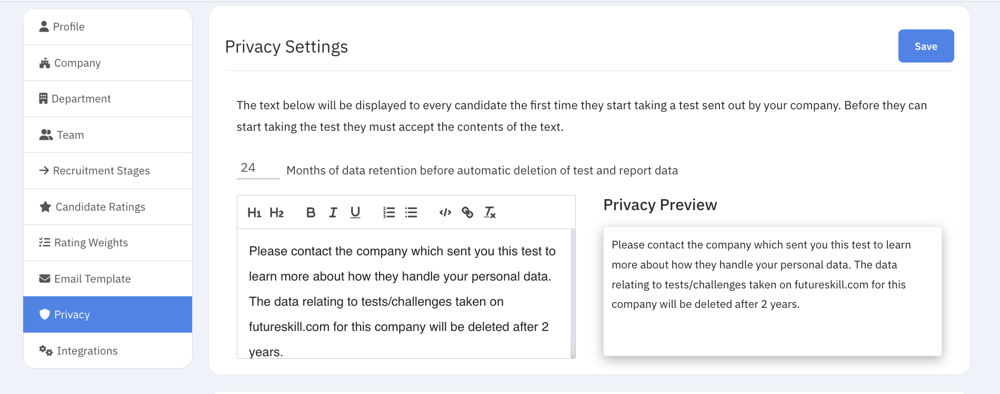

# Privacy and GDPR

SkillATS helps you handle candidate privacy and retention rules.

## Consent when people apply

On your career site, applicants typically agree to privacy terms as part of applying. On a candidate profile you may see options to renew consent or handle deletion requests.

## Candidates due for deletion

In **Settings**, look for the link to candidates whose data is approaching deletion under your retention period. Review that list regularly and open anyone who needs a decision.

!!! tip
Align retention settings with your company’s policy before you rely on automated deletion lists.
