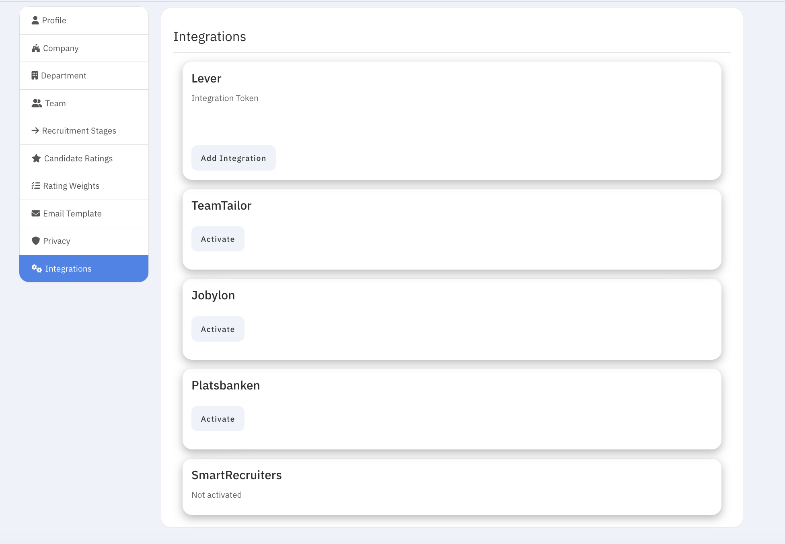

# Integrations

In **Settings → Integrations** you can connect SkillATS to other hiring tools and job boards.

## Common connections

| Integration         | Typical use                        |
| ------------------- | ---------------------------------- |
| **Platsbanken**     | Publish jobs to Arbetsförmedlingen |
| **Jobylon**         | Sync with Jobylon                  |
| **Lever**           | Sync with Lever                    |
| **Teamtailor**      | Sync with Teamtailor               |
| **SmartRecruiters** | Connect SmartRecruiters            |

Follow the on-screen connect steps for each provider. After connecting, some options (such as posting a specific job) may also appear when you edit that job.

!!! tip
If a connection fails, confirm you have admin rights in both SkillATS and the other system, then try again or contact support.
