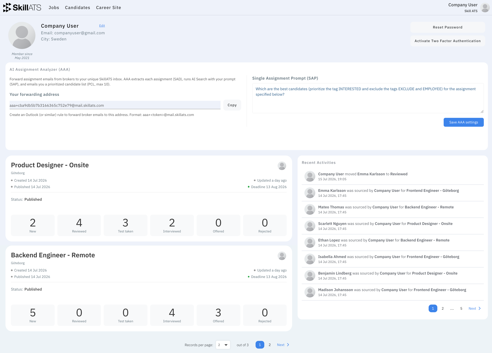

# Your profile

Open **Profile** from the dashboard or account menu to manage your own account.

## What you can do

- Update your name and contact details
- Change your password
- Turn on two-factor authentication if it’s available
- View recent activity
- Set up **AI Assignment Analyzer (AAA)** — only on **your** profile

AAA is personal: each recruiter has their own forwarding address and prompt. See [Set up AAA](../aaa/Setup.md).

